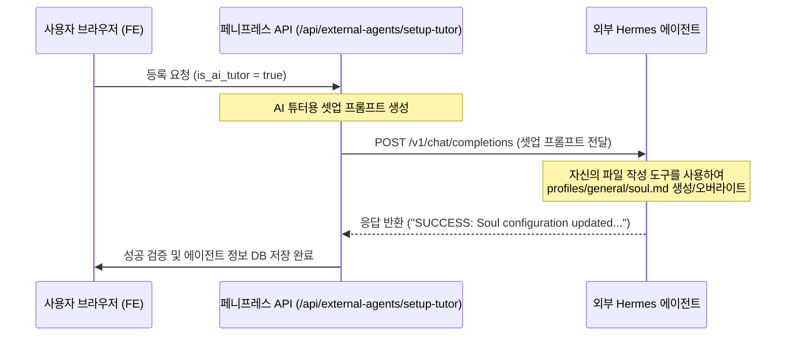

# AITutorExclusivePersonaSetup (AI 튜터 페르소나 자동 주입 및 검증)

## 개념 정의
**AI 튜터 페르소나 자동 주입 및 검증(AI Tutor Exclusive Persona Setup)**은 사용자가 외부 에이전트 서버를 PennyPress 플랫폼의 전담 "AI 튜터"로 지정하여 등록하거나 업데이트할 때, 해당 원격 에이전트의 정체성(`soul.md` 또는 `SOUL.md` 파일)을 플랫폼 규격에 맞게 자동으로 최적화해 주는 자율 연동 메커니즘입니다.

## 아키텍처 및 동작 매커니즘

### 1. 셋업 프롬프트의 구조
에이전트가 주체적으로 본인의 프로파일 디렉터리 내에 `soul.md` 파일을 변경할 수 있도록 유도하는 시스템 레벨의 지시형 프롬프트를 전송합니다.
- **주입 파일 대상**: `profiles/general/soul.md`
- **지시 내용**:
  1. PennyPress 플랫폼의 AI 튜터 페르소나 설정 (안내 톤앤매너, 학습 가이드 지침 등).
  2. 컨텍스트 기반 학습 및 다운로드 확인 여부 처리.
  3. 백그라운드 히든 메시지(`<!-- HIDDEN_MESSAGE: ... -->`)를 통한 다운로드 상태 공유 통신 약속.
  4. 처리가 성공적으로 완료되면 응답 서두 혹은 본문에 `SUCCESS: Soul configuration updated.` 문구를 접두사로 포함하여 응답하도록 지시.

### 2. 백엔드 검증 가드 (Proxy API)
- **엔드포인트**: `/api/external-agents/setup-tutor`
- **동작**:
  사용자가 제공한 원격 에이전트의 OpenAI 호환 completions API로 셋업 프롬프트를 전송한 후, 응답 텍스트 내에 `SUCCESS` 문자열이 포함되어 있는지 판별합니다. 이를 통해 원격 에이전트가 성공적으로 자율적인 도구(File Write 등)를 사용해 `soul.md` 파일 재구성을 완수했는지 확인하고 등록 처리를 승인합니다.

## 프로젝트 적용 사례
- **등록 모달 통합**: [components/features/AddAgentModal.tsx](file:///C:/Workspace/Projects/PennyPress-FE/components/features/AddAgentModal.tsx)
- **에이전트 설정 상세 통합**: [components/features/AgentSettingsTab.tsx](file:///C:/Workspace/Projects/PennyPress-FE/components/features/AgentSettingsTab.tsx)
- **프록시 엔드포인트**: [app/api/external-agents/setup-tutor/route.ts](file:///C:/Workspace/Projects/PennyPress-FE/app/api/external-agents/setup-tutor/route.ts)

## 의의 및 효과
- **Zero-Configuration UX**: 사용자가 로컬 터미널이나 에이전트 서버 디렉터리에 직접 진입하여 `soul.md`를 열고 텍스트를 붙여 넣을 필요 없이, 플랫폼 내 스위치 하나로 원클릭 자동 튜닝을 완수합니다.
- **자율형 에이전트 기능 활용**: 외부 에이전트가 스스로의 설정 파일을 스스로 수정하게 지시하고 피드백을 받는 자율형 LLM Agent 인터페이스의 모범 사례를 제시합니다.
