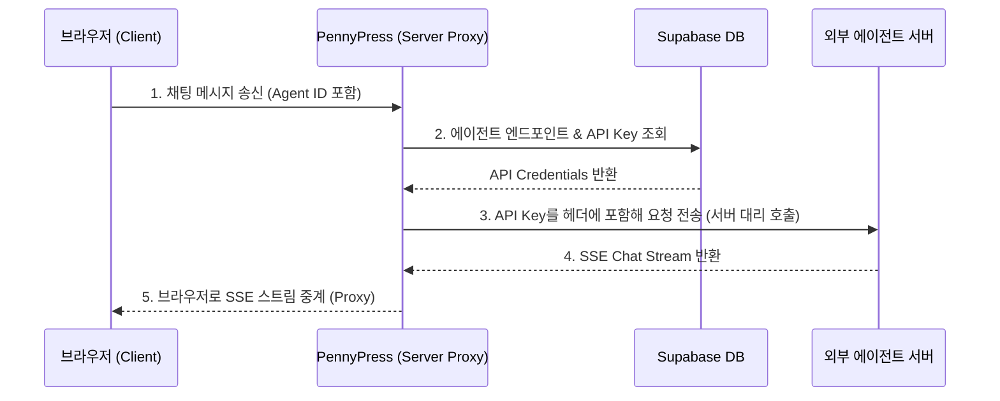

# ExternalHermesAgent (개념)

- **설명**: [[PennyPress]] 플랫폼 외부(사용자 로컬, 별도 가상 머신, 타사 클라우드 등)에서 독자적으로 호스팅 및 기동되는 [[HermesAgent]] API 서버를 뜻합니다.
- **주요 특징**:
  - **독립성**: 사용자가 서버 인프라를 직접 제어하며, 리소스 제한 없이 에이전트를 자율적으로 운용할 수 있습니다.
  - **API 호환성**: OpenAI와 유사한 규격을 따르며, `/v1/chat/completions`, `/v1/models`, `/health` 엔드포인트를 노출해야 합니다.
  - **보안성**: API Key를 통한 인증을 지원하여, 허가되지 않은 외부 요청으로부터 에이전트 인스턴스를 보호할 수 있습니다.

## 🔒 보안 아키텍처

사용자 에이전트 서버의 보안 위협과 정보 유출을 차단하기 위해 다음과 같은 중계 아키텍처가 설계 및 적용되었습니다.

1. **SSRF (Server-Side Request Forgery) 차단**:
   - 브라우저에서 직접 외부 에이전트 엔드포인트로 요청을 날리는 대신, 세션 인증이 완료된 Next.js API Route Handler를 통해서만 중계됩니다.
   - 요청을 보내기 전, 접속한 사용자가 해당 외부 에이전트의 등록 정보 소유자인지 Supabase에서 검증합니다.
2. **API Key 유출 방지**:
   - 에이전트의 엔드포인트 URL과 API Key는 Supabase DB에 RLS 정책이 걸린 상태로 보관되며, 프론트엔드로 직접 노출되지 않고 프록시 서버 내부에서만 활용됩니다.
3. **실시간 스트리밍 중계**:
   - SSE(Server-Sent Events) 프로토콜을 사용하며, 브라우저가 대화를 중단하는 경우(`AbortController`) Next.js 서버에서 외부 서버로의 fetch 요청도 함께 중단(`req.signal` 연동)하여 외부 에이전트 서버의 무리한 토큰 사용을 제어합니다.
   - Vercel이나 Nginx 등의 환경에서 프록시 버퍼링을 방지해 글자가 실시간으로 흐르듯 출력되도록 `X-Accel-Buffering: no` 헤더가 추가되었습니다.

## 🔗 관련 개념

- [[LocalLLMAgentIntegration]]: Ollama, LM Studio 등 로컬 LLM 런타임을 동일한 등록 구조로 연동하기 위한 갭 분석 (2026-07-05 리서치).
