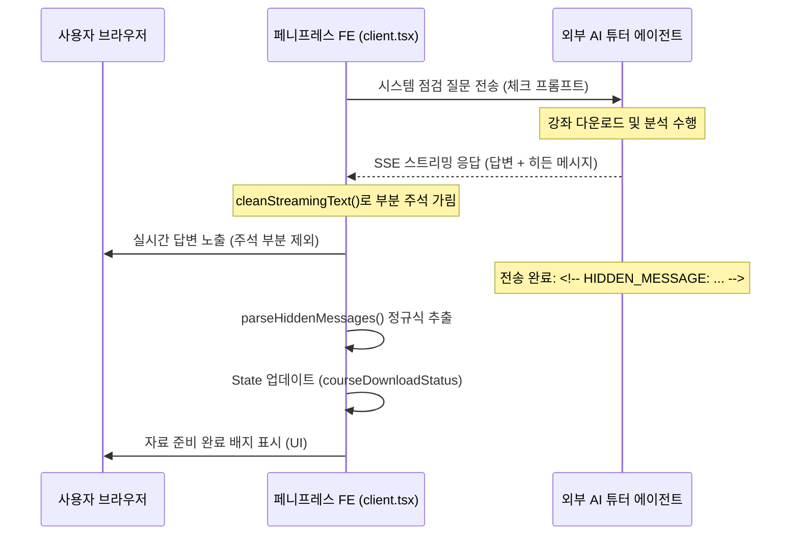

# HiddenMessageParsing (히든 메시지 파싱)

## 개념 정의
**히든 메시지 파싱(Hidden Message Parsing)**은 외부 AI 에이전트와 페니프레스 웹 애플리케이션 간에 대화형 인터페이스를 통해 사용자에게 노출하지 않고 백그라운드 데이터/이벤트(예: 강좌 리소스 로드 상태, 작업 완료 신호, 유저 메타데이터 업데이트 명령 등)를 연동하기 위해 수립된 통신 규격 및 파싱 패턴입니다.

## 아키텍처 및 동작 메커니즘



### 1. 전송 규격
마크다운 파서 및 브라우저에서 화면에 출력되지 않는 HTML 주석(`<!-- ... -->`)을 Wrapper로 사용하고 내부 데이터를 JSON 구조로 패킹합니다.
```html
<!-- HIDDEN_MESSAGE: {"action": "download_status", "downloaded": true} -->
```

### 2. 스트리밍 전처리 (`cleanStreamingText`)
SSE(Server-Sent Events) 스트리밍 도중 주석 시작 표시인 `<!--`가 들어왔으나 종결 기호 `-->`가 아직 없는 불완전한 조각(Chunk) 상태일 때, 해당 태그 구문 전체가 브라우저에 임시 텍스트로 보이지 않도록 앞부분까지만 강제 슬라이싱하여 격리합니다.

### 3. 정규식 추출 및 스트립 (`parseHiddenMessages`)
완전한 `-->`가 매칭되면, 정규식 `/<!--\s*HIDDEN_MESSAGE:\s*(\{[\s\S]*?\})\s*-->/g`을 통해 내부 JSON 문자열을 찾아 `JSON.parse`를 수행하고, 감지된 주석 전체를 본문 문자열에서 제거합니다.

## 프로젝트 적용 사례
- **강좌 학습 자료 다운로드 상태 추적**: AI 튜터가 강좌 학습용 리소스 파일을 자신의 로컬 워크스페이스에 성공적으로 캐싱했는지 여부를 파싱하여 클라이언트의 `courseDownloadStatus` 리액트 상태에 주입, 실시간 준비 상태 배지를 렌더링하고 있습니다.
- **주소 연동**: [app/(user)/learn/[slug]/client.tsx](file:///C:/Workspace/Projects/PennyPress-FE/app/(user)/learn/[slug]/client.tsx)

## 장점 및 모범 사례
- **클라이언트 리소스 차단 제거**: 사용자 화면에 난잡한 원본 JSON 주석이 번쩍이거나 렌더링을 어지럽히는 현상을 원천 방지합니다.
- **낮은 오버헤드**: 복잡한 별도의 SSE 커스텀 이벤트 채널을 개설할 필요 없이 표준 챗 완성 API 응답 채널을 그대로 활용할 수 있어, 레거시 외부 게이트웨이 연동에 적합합니다.
