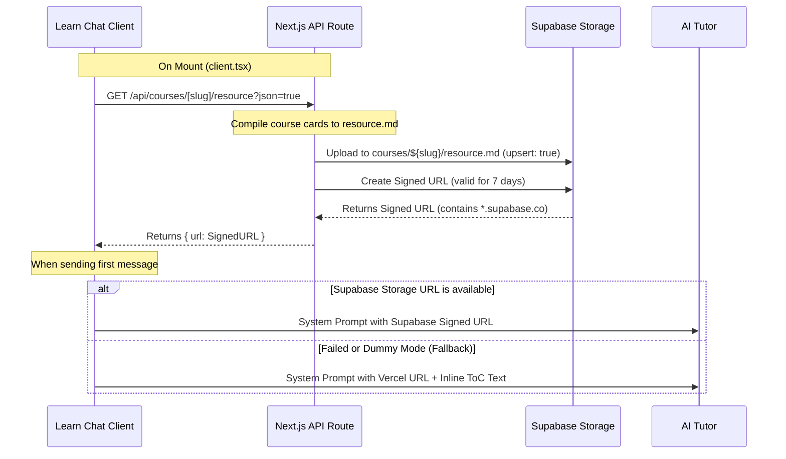

# Vercel SSO 우회를 위한 Supabase Storage 리소스 업로드 및 fallback ToC 구현

## 개요
Vercel Preview Deployment 환경 등에서 적용되는 SSO(배포 보호) 인증 장벽으로 인해, 외부 AI 튜터(Tencent Cloud 등에서 호출됨)가 Next.js 호스트의 `/api/courses/[slug]/resource` 엔드포인트에 접근하지 못하는 문제를 해결하기 위해, 강좌 전체 리소스를 Supabase Storage에 컴파일하여 업로드하고 외부에서 접근 가능한 Supabase Storage URL(Signed URL / Public URL)을 생성하여 전달하는 기능과 이중화 Fallback 안전장치를 구현한 내역입니다.

## 문제 원인
Vercel SSO가 활성화되면, 브라우저 세션 쿠키가 없는 외부 서비스(AI Tutor Worker 등)가 API Route에 호출을 보낼 때 302 Redirect 또는 401 Unauthorized 코드를 받게 됩니다. 이로 인해 AI 튜터가 강좌 교안 리소스를 다운로드하지 못해 학습 컨텍스트를 주입받을 수 없는 장애가 발생합니다.

## 해결 방법 및 아키텍처



### 1. API 엔드포인트 고도화 (`/api/courses/[slug]/resource`)
- [route.ts](file:///C:/Workspace/Projects/PennyPress-FE/app/api/courses/[slug]/resource/route.ts)
- GET 요청 시 강좌 메타데이터와 카드 파일들을 병합하여 컴파일된 Markdown 파일(`resource.md`)을 구성합니다.
- `!isDummy` 모드인 경우, `createAdminClient()`의 service_role 권한을 이용하여 Supabase Storage `courses` 버킷의 `${slug}/resource.md` 경로로 파일을 업로드(`upsert: true`)합니다.
- 업로드 성공 후 **7일간 유효한 Signed URL**을 생성하고, 실패 시 **Public URL**을 Fallback으로 가져옵니다.
- 쿼리 매개변수 `?json=true`가 전달된 경우, `{ url: string }` 포맷의 JSON 응답을 반환하고, 일반 호출 시 기존과 동일하게 컴파일된 Markdown 텍스트 자체를 반환하여 하위 호환성을 유지합니다.

### 2. 클라이언트 연동 및 프롬프트 주입
- [client.tsx](file:///C:/Workspace/Projects/PennyPress-FE/app/(user)/learn/[slug]/client.tsx)
- 컴포넌트 마운트 시 `useEffect`에서 `/api/courses/[slug]/resource?json=true` API를 비동기 호출하여 Supabase Storage URL을 조회 후 `supabaseResourceUrl` 상태로 저장합니다.
- AI 튜터 대화 전송 (`handleSend`) 시점:
  - `supabaseResourceUrl` 값이 유효하고 `*.supabase.co` 도메인을 포함하는 경우 이를 `systemPrompt` 내 `resourceUrl`에 바인딩합니다.
  - 그렇지 않은 경우(로컬 더미 데이터 모드 또는 스토리지 연동 실패 시) 기본 Vercel Host API 주소(`window.location.origin + ...`)로 대체합니다.

### 3. 이중화 Fallback 안전장치 (Inline ToC)
- Supabase Storage URL 획득에 실패하거나 로컬 더미 데이터 모드인 경우(즉, 리소스 URL이 `*.supabase.co`를 포함하지 않는 Fallback 상황), 세션의 첫 질문 전송 시점에 클라이언트가 가지고 있는 목차(ToC) 데이터(`cards` 객체의 타이틀 목록)를 프롬프트 내에 직접 인라인 텍스트로 보조 전송하는 안전장치를 구현했습니다.
  ```typescript
  if (isFallback && isFirstQuestion) {
    const tocLines = cards.map((c, idx) => `${idx + 1}. ${c.title}`).join('\n');
    fallbackTocText = `\n\n[Fallback Course Table of Contents]\n${tocLines}...`;
  }
  ```

## 검증 결과
- **Supabase Storage 도메인 확인**: 생성된 URL이 `https://fbaxselsdfceyygdvpnj.supabase.co/storage/v1/object/sign/courses/...` 형태로 `*.supabase.co` 도메인을 정상 지칭하고 있음을 확인했습니다.
- **프로덕션 빌드**: `npm run build` 결과, 정적 페이지 빌드 및 TypeScript 타입 검사에서 경고 없이 빌드가 성공적으로 완료되었습니다.
