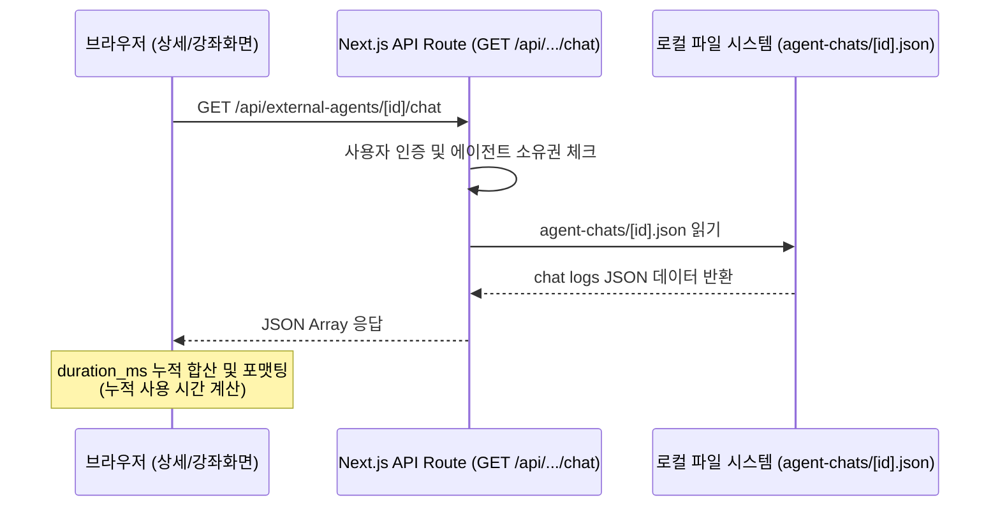

# 에이전트 통계 실데이터 및 누적 사용 시간 연동

## 개요
기존에 에이전트 상세 화면 및 강좌 상세 화면의 통계 탭/섹션에서 보여주던 사용 통계(누적 사용 시간, 평균 응답 시간, 토큰 사용량 등)는 에이전트 ID 해시값을 활용한 가짜 모킹 데이터였습니다.
본 작업을 통해, 챗 요청이 발생하고 에이전트로부터 응답이 완료될 때까지 측정되어 누적 기록된 실제 메트릭 파일(`public/agent-chats/[id].json`)의 데이터를 API를 통해 직접 불러와 동적으로 합산/계산하여 보여주도록 연동을 개선하였습니다.

## 주요 변경사항

### 1. 백엔드 통계 데이터 조회 API 추가
- **파일**: [route.ts](file:///C:/Workspace/Projects/OpenTutor/app/api/external-agents/[id]/chat/route.ts)
- **변경 사항**: 
  - `GET` 요청 핸들러를 추가하여, 요청한 사용자가 해당 에이전트의 소유주인지 권한 검증(Supabase RLS 대용)을 완료한 후, 로컬 파일 시스템 내 `public/agent-chats/[agentId].json`에 누적되어 기록된 로그 배열을 응답합니다.
  - 파일이 존재하지 않는 경우(대화 내역이 전혀 없는 경우)는 예외 없이 빈 배열 `[]`을 반환합니다.

### 2. 에이전트 상세 화면 통계 탭 개편
- **파일**: [page.tsx](file:///C:/Workspace/Projects/OpenTutor/app/(user)/my-agents/[id]/page.tsx)
- **변경 사항**:
  - `AgentStatisticsTab` 내부에서 `useState`와 `useEffect`를 도입해 컴포넌트 마운트 시 `/api/external-agents/[id]/chat`을 호출하여 챗 로그 실데이터 목록을 fetch 하도록 처리했습니다.
  - 불러온 데이터가 없는 로딩 시점에는 스켈레톤 애니메이션 바를 표출하여 자연스러운 UX를 도모합니다.
  - 챗 로그에 저장되어 있는 `duration_ms`들의 합을 **누적 사용 시간**으로, `duration_ms`들의 평균을 **평균 응답 시간**으로 계산하여 표시합니다.
  - **포맷팅**: 누적 사용 시간의 경우 60초 미만은 초 단위(예: `15.4초`), 60초 이상 1시간 미만은 분/초 단위(예: `2분 15초`), 1시간 이상은 시간/분 단위(예: `1시간 23분`)로 스마트하게 변환하여 가독성을 높였습니다.

### 3. 강좌 상세 화면 튜터 통계 섹션 개편
- **파일**: [client.tsx](file:///C:/Workspace/Projects/OpenTutor/app/(user)/courses/[slug]/client.tsx)
- **변경 사항**:
  - 강좌 상세 화면 우측의 "튜터 에이전트 선택" 영역 하단에도 동일하게 튜터 통계가 표현됩니다.
  - 튜터 에이전트 ID가 지정되어 활성화될 때 비동기로 챗 로그를 fetch하고 실제 사용 통계를 계산해 표현하는 `AgentStatsView` React 서브 컴포넌트를 설계하여 적용했습니다.

## 연동 방식 흐름도

## 기대 효과
- **실제 사용량 기반 메트릭 제공**: 연결된 상태의 무의미한 대기 시간이 아니라, 실제로 모델에게 질문을 보낸 시점부터 완전한 응답을 획득한 시점까지의 연산 시간이 합산되어 표시됨으로써 에이전트 사용 가치를 실감할 수 있습니다.
- **포맷팅 일관성 및 정적 리소스 서빙 문제 방지**: 빌드 런타임에 동적으로 변경되는 `public/` 내의 파일을 브라우저가 직접 정적 Fetch를 시도할 경우 발생할 수 있는 Next.js 런타임 정적 서빙 에러를 방지하고, 서버사이드 `fs` 연동 API를 거침으로써 데이터 안전성을 확보하였습니다.
